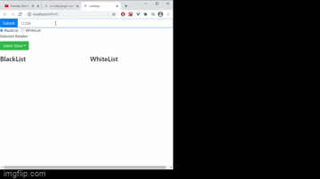

# reactHooksChicory
Client application in where the user selects a retailer using a drop down.


## To Run:

```
git clone https://github.com/jolaya182/reactHooksChicory.git

```
To run go to the folder: reactHooksChicory

To install:
```
npm  i
```

To run go to the src folder:

```
npm run-script startwebapplication
```


go to `http://localhost:8080/` url on your webbrowser


To use jest test on the backend
```
npm test index.test.js 
```
To use puppeteer on the front end
```
npm run-script runserver
npm test puppeteer.test.js